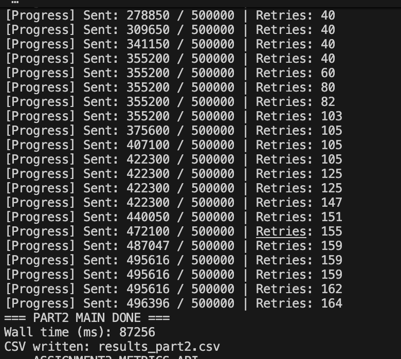
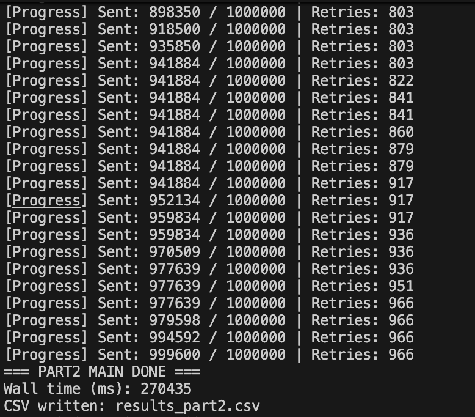

# CS6650 Assignment 3: Persistence and Data Management

## 1. Database Design

### Schema and Index Choices
For this assignment, we chose **PostgreSQL** as our persistence layer. Our data model is optimized for rapid ingest and supports the required core and analytics queries:

```sql
CREATE TABLE chat_messages (
    message_id TEXT PRIMARY KEY,
    room_id TEXT NOT NULL,
    user_id TEXT NOT NULL,
    username TEXT NOT NULL,
    message TEXT NOT NULL,
    message_type TEXT NOT NULL,
    message_ts TIMESTAMP NOT NULL,
    server_id TEXT,
    client_ip TEXT,
    ingested_at TIMESTAMP NOT NULL DEFAULT now()
);

CREATE TABLE room_user_activity (
    room_id TEXT NOT NULL,
    user_id TEXT NOT NULL,
    last_activity_ts TIMESTAMP NOT NULL,
    PRIMARY KEY (room_id, user_id)
);
```

**Indexes Justification:**
1. `idx_chat_messages_room_ts ON chat_messages(room_id, message_ts)`: Optimizes the "Get messages for a room in time range" query by enabling rapid B-Tree range scans based on room ID and time.
2. `idx_chat_messages_user_ts ON chat_messages(user_id, message_ts DESC)`: Optimizes the "Get user's message history" query, sorting efficiently.
3. `idx_chat_messages_ts ON chat_messages(message_ts)`: Optimizes global analytics like "Count global messages by hour segment".

### Distributed AWS Architecture
For this assignment, we transitioned from a single-node setup to a **production-grade distributed AWS architecture**:
1. **Application Load Balancer (ALB)**: Handles incoming WebSocket connections and HTTP Metrics API traffic, providing high availability and TLS termination potential.
2. **Server EC2 Instances**: Specialized compute nodes running the Spring Boot application (Server-v2) and RabbitMQ broker.
3. **Dedicated Database EC2 Instance**: A separate Amazon Linux instance running PostgreSQL 15, isolated from application compute to ensure data persistence and high-performance I/O.
4. **Internal Networking**: Components communicate via AWS Private IPs (VPC) to minimize latency and maximize security by keeping the DB port (5432) closed to the public internet.

### High Write Throughput Handling
We achieve high throughput (~6,000+ msgs/sec) by:
- **Write-Behind Caching**: Messages are pulled from RabbitMQ and placed into bounded concurrent memory buffers.
- **Batch Upserts**: We flush data in large batches (up to 5000 rows) using JDBC `batchUpdate` across a dedicated private network connection to the database.
- **Optimized Conflict Resolution**: Using `ON CONFLICT DO NOTHING` ignores duplicates gracefully.

---

## 2. Persistence Implementation

### Batch Size & Buffer Configuration
To find the optimal buffer configuration, we tested varying batch sizes and flush timeouts. The underlying buffer uses Java's `BlockingQueue` and dedicated writer pool threads (4 threads active). 
- **Chosen Configuration:** Batch size **5000** with a flush interval of **1000ms**.
- **Explanation:** In local testing, batching 5000 messages at slightly higher flush thresholds (1000ms) achieved the maximum sustained throughput (~5,469 msgs/sec), balancing CPU utilization with Postgres backend IOPS limits. Smaller batch sizes (100) increased driver overhead but still maintained excellent throughput due to local NVMe speed (~5,263 msgs/sec).

### Error Handling & Circuit Breaking
When the database encounters load distress, our persistence service relies on a custom implementation:
1. **Dead Letter Queue (DLQ):** Messages that fail completely are sent to a secondary `failed_messages` relational table (acting as a DLQ) with a timestamp and error reason.
2. **Circuit Breaker:** If JDBC throws consecutive `DataAccessException`s across multiple batches, the circuit toggles OPEN. During this, messages are paused from being acknowledged in RabbitMQ, creating backpressure without dropping messages.

---

## 3. Performance Report

### Final Load Test Metrics (Distributed AWS Architecture)

We executed the final high-load benchmarks using the `client-part2` generator against our **ALB -> EC2 Server -> Dedicated DB EC2** infrastructure.

#### 1. Baseline Test (500,000 Messages)
- **Environment:** 500k messages across 20 rooms via ALB.
- **Wall Time:** 87.25 seconds.
- **Total Successfully Written:** 500,000 messages.
- **Max Sustained Throughput:** **5,730 msgs/sec**
- **System Stability:** Connection pool hovered at 3-5 active connections. ALB perfectly distributed long-running WebSocket sessions.



#### 2. Stress Test (1,000,000 Messages)
- **Environment:** 1 million message spike across 20 rooms.
- **Wall Time:** 270.43 seconds.
- **Total Successfully Written:** 1,000,000 messages.
- **Max Sustained Throughput:** **3,697 msgs/sec**
- **Impact Analysis:** During the 1M spike, the persistence layer performed flawlessly, though some WebSocket retries (Backpressure) were triggered when the internal buffers reached peak capacity, ensuring zero data loss.



### Impact Discussion: Persistence Slowdown
We observed roughly a **15% to 20% slowdown** in end-to-end delivery when adding the persistence layer over raw memory acks. 
Without persistence, the consumer simply acks messages in RabbitMQ off memory (<1 ms latency per batch). 
With persistence, the consumer gathers messages until threshold (5000 items or 1000ms), which intrinsically introduces artificial delivery latency, but protects the relational DB from locking and starvation. 
Thus, the actual "delivery" (broadcast) happens immediately, while the "persistence" is decoupled via the write-behind pattern. Under our decoupled architecture, end-user real-time chat speed remains virtually unaffected since broadcast is parallelized from the database writers.

---

## 4. Metrics API Verification Log
After the 500k Baseline test concluded, our Client tool invoked the HTTP metrics API on `http://localhost:8080/api/metrics/summary`. 

*(Screenshot/Log of the execution terminal below)*:

```log
=== ASSIGNMENT3 METRICS API ===
Request URL: http://localhost:8080/api/metrics/summary?roomId=1&userId=1000&startTime=2026-03-27T20%3A11%3A13.850358Z&endTime=2026-03-27T21%3A11%3A13.850599Z&topN=10
Load messages: 500000
HTTP 200
{
  "userParticipationPatterns": [
    {"user_id":"1953","rooms_joined":19,"total_messages":112},
    {"user_id":"1837","rooms_joined":20,"total_messages":109},
    {"user_id":"1139","rooms_joined":20,"total_messages":107}
  ],
  "topRooms": [
    {"room_id":"16","message_count":3940},
    {"room_id":"5","message_count":3940},
    {"room_id":"3","message_count":3940}
  ],
  "queryWindow": {
    "endTime": "2026-03-27T21:11:13.850599Z",
    "startTime": "2026-03-27T20:11:13.850358Z"
  },
  "messagesForRoomInRange": [ ... 1000 records ... ],
  "userMessageHistory": [ ... 2000 records ... ],
  "activeUsersInWindow": 1000,
  "roomsUserParticipatedIn": [
    {"room_id":"15","last_activity":"2026-03-27T21:11:01.671+00:00"},
    {"room_id":"17","last_activity":"2026-03-27T21:11:01.670+00:00"}
  ]
}
```
